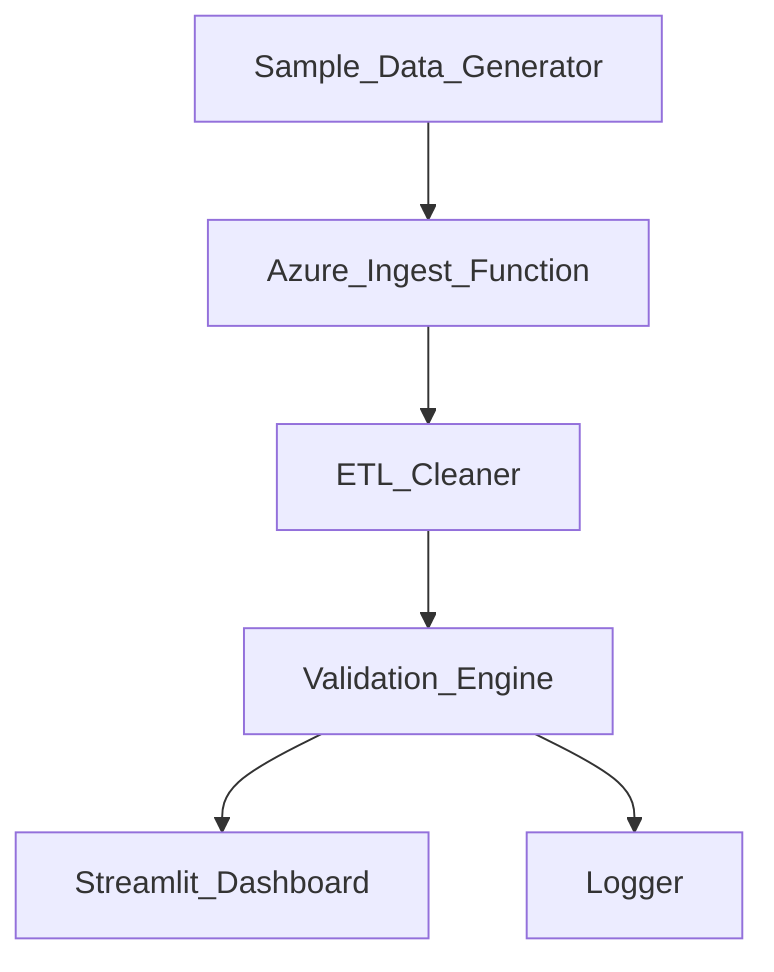

# Risk Metrics ETL & Validation Pipeline (Azure + Streamlit)

A fully functional data engineering pipeline for **risk metric ingestion, ETL processing, validation, and dashboard monitoring**, inspired by real workflows used in **energy trading**, **quant risk**, and **DevOps pipelines** at companies like **E.ON Energy Markets GmbH**.

This project simulates an **Azure Function–based ingestion system**, applies **ETL cleaning**, runs a **rule-based validation engine**, and displays results through an interactive **Streamlit dashboard**.

---

# 📌 Project Overview

Energy trading and risk teams rely on daily metrics such as:

- **P50 / P95 forecasts**  
- **Spreads**  
- **Delta**  
- **Volatility clusters**

This system automates the workflow required to ingest, clean, validate, and monitor such metrics at scale.

### ✔ Highlights

- Simulated **Azure Function ingestion**
- ETL processing with **cleaning, normalization, date parsing**
- YAML-configured **risk validation rules**
- **Quality flags (GREEN/YELLOW/RED)** based on null ratio and metric rules
- Monitoring dashboard built with **Streamlit**
- Modular, production-inspired folder structure

---

# 🏗 System Architecture (Mermaid Diagram)

Below is the real output generated by this pipeline:

📂 Folder Structure
arduino
Copy code
azure-risk-metrics-etl-monitoring/
│── dashboard_screenshot.png
│── README.md
│── requirements.txt
│── generate_sample_data.py
│── config/
│   └── validation_rules.yaml
│── data/
│   ├── sample_risk_data.csv
│   ├── raw/
│   ├── processed/
│   └── reports/
│── dashboard/
│   └── streamlit_app.py
│── etl/
│   └── risk_etl_cleaner.py
│── functions/
│   └── azure_ingest_function.py
│── utils/
│   └── logger.py
│── validation/
│   └── risk_validation_engine.py
⚙️ How It Works
1️⃣ Sample Data Generator
Creates a 3-month dataset with:

3 portfolios (A/B/C)

Metrics: P50, P95, Spread, Delta, Vol

~1350 rows

Random missing values (simulating real risk data issues)

Run:

bash
Copy code
python generate_sample_data.py
2️⃣ Simulated Azure Ingestion
Copies the daily snapshot into a raw/ folder, mimicking an Azure Function triggered by:

Blob upload

Timer events

ETRM pipelines

Run:

bash
Copy code
python -m functions.azure_ingest_function
3️⃣ ETL Cleaner
Normalizes columns

Parses dates

Removes whitespace

Ensures consistent formatting

Run:

bash
Copy code
python -m etl.risk_etl_cleaner
4️⃣ Validation Engine
Applies YAML rules:

Required columns

Min value thresholds

Null fraction limits per metric

Overall GREEN / YELLOW / RED flag

Run:

bash
Copy code
python -m validation.risk_validation_engine
Output written to:

data/processed/risk_snapshot_clean.csv

data/reports/validation_report.csv

5️⃣ Streamlit Dashboard
Interactive monitoring UI:

Portfolio selector

Table & line chart visualizations

Validation summary

Overall quality status

Run:

bash
Copy code
streamlit run dashboard/streamlit_app.py
🎯 Why This Project Matters (E.ON Alignment)
This project directly matches responsibilities in the E.ON Energy Markets – Working Student / Quantitative Risk / DevOps role:

✔ Cloud workflows (Azure Function simulation)
✔ Data pipelines (ETL → processed datasets)
✔ Risk metrics understanding (P50/P95/spread/delta/vol)
✔ Data validation & governance
✔ Dashboarding (Streamlit = similar to internal UIs)
✔ YAML-based config (common in risk platforms)
✔ Logging, structure, rule-based checks
This is exactly the type of real-world workload handled in energy trading risk & DevOps teams.

📌 Technologies Used
Python 3.10+

Pandas

NumPy

PyYAML

Streamlit

Loguru

Azure Function simulation

Rule-based validation engine

🚀 Running Everything End-to-End
Step 1 — Install dependencies
bash
Copy code
pip install -r requirements.txt
Step 2 — Generate dataset
bash
Copy code
python generate_sample_data.py
Step 3 — Simulate ingestion
bash
Copy code
python -m functions.azure_ingest_function
Step 4 — ETL + validation
bash
Copy code
python -m validation.risk_validation_engine
Step 5 — Launch dashboard
bash
Copy code
streamlit run dashboard/streamlit_app.py
📝 License
MIT License.

🙌 Author
Siddharth Sunil Bhosale
Master's in Artificial Intelligence Engineering (THI – Germany)
Focus: Data Engineering, Quantitative Risk, ETL Pipelines, Energy Markets Analytics